# Agora

Agora is a phone-first apartment society management app built for the ChaiCode and Masterji Mobile Dev Hackathon (July 12-26, 2026).

It replaces gate calls, paper registers, and fragmented WhatsApp coordination with three isolated mobile experiences:

- Resident: visitor approvals and pre-approvals, notices, polls, complaints, amenities, visitor history, maintenance dues, own vehicles/parking, society documents, and the active society directory.
- Security Guard: resident lookup, visitor registration, approval verification, QR scanning, entry/exit, a live digital logbook, parking lookup, society documents, and assigned operational tasks.
- Society Admin: towers, flats, household members, guard accounts, notices, polls, complaints, amenities, maintenance billing, parking/vehicle assignments, society documents, daily tasks, staff, providers, audit records, and read-only visitor history.

The hero journey is a tracked visitor lifecycle: Guard request -> Resident decision -> Guard verification -> Entry -> Exit.

## Demo video

Watch the phone-first Agora walkthrough, with the visitor lifecycle as the hero workflow.

<p align="center">
  <video src="docs/demo/agora-hero-workflow.mp4" controls width="720">
    Your browser cannot play this video.
  </video>
</p>

<p align="center">
  <a href="docs/demo/agora-hero-workflow.mp4"><strong>Watch or download the Agora hero workflow demo (MP4)</strong></a>
</p>

## Stack

- Expo 57 and React Native 0.86
- Expo Router role groups and protected routes
- Supabase Auth, Postgres, RLS, Realtime, Storage, and Edge Functions
- TanStack Query for server state
- Zustand for client-only session/UI state
- Expo Notifications, Camera, SecureStore, and Image modules
- Sentry React Native integration
- pgTAP database security tests and GitHub Actions quality gates

See [Architecture](docs/ARCHITECTURE.md), [Feature and role tracker](docs/FEATURE_IMPLEMENTATION_TRACKER.md), [Judge demo script](docs/DEMO_SCRIPT.md), and [AGENTS.md](AGENTS.md).

## Role workflows

### Resident

Residents can pre-approve guests, review their private gate history, participate in community decisions, and access everyday society services.

<table>
  <tr>
    <td align="center">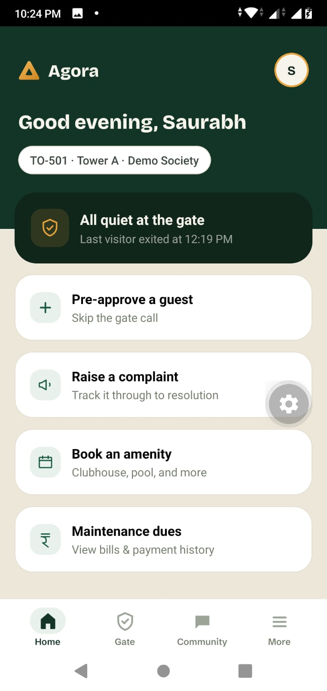<br><sub>Resident dashboard</sub></td>
    <td align="center">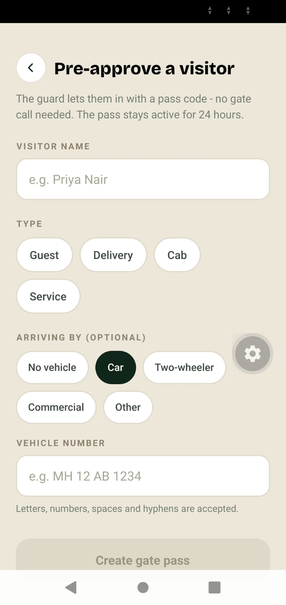<br><sub>Guest pre-approval</sub></td>
  </tr>
  <tr>
    <td align="center">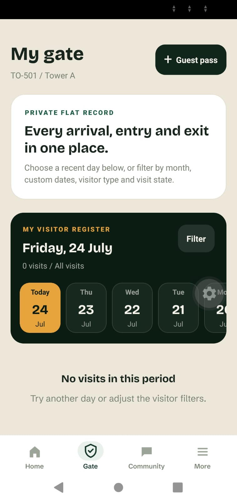<br><sub>Private gate history</sub></td>
    <td align="center">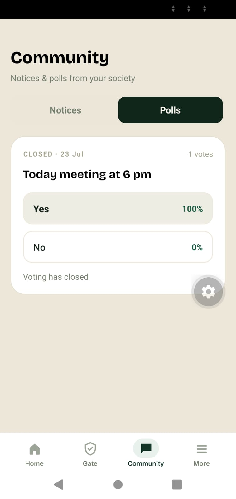<br><sub>Community polls</sub></td>
  </tr>
  <tr>
    <td align="center" colspan="2">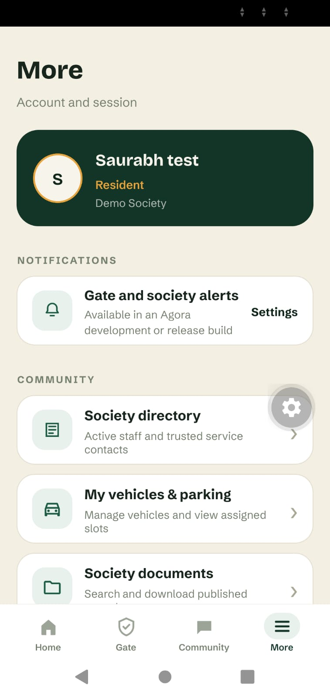<br><sub>Account &amp; society services</sub></td>
  </tr>
</table>

### Security Guard

Guards register arrivals, verify current approvals and QR passes, monitor live gate movement, and review the society logbook.

<table>
  <tr>
    <td align="center">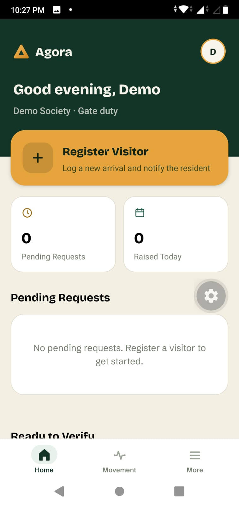<br><sub>Guard dashboard</sub></td>
    <td align="center">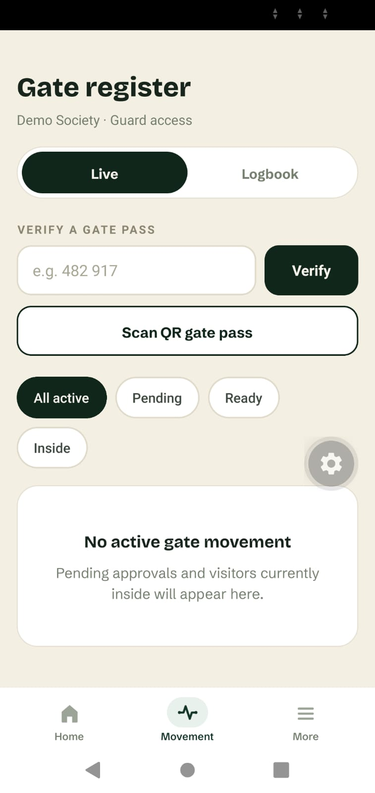<br><sub>Live verification</sub></td>
  </tr>
  <tr>
    <td align="center">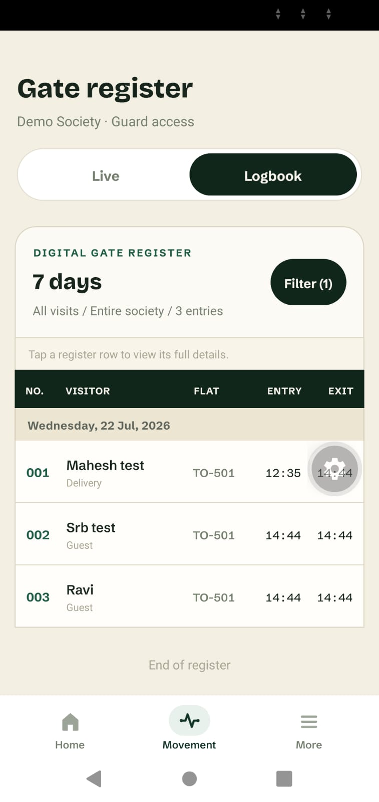<br><sub>Digital gate logbook</sub></td>
    <td align="center">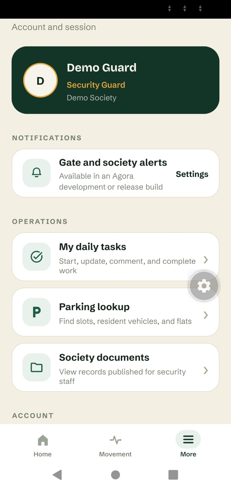<br><sub>Guard operations</sub></td>
  </tr>
</table>

### Society Admin

The admin workspace centralizes society setup, resident operations, community communication, and oversight.

<table>
  <tr>
    <td align="center">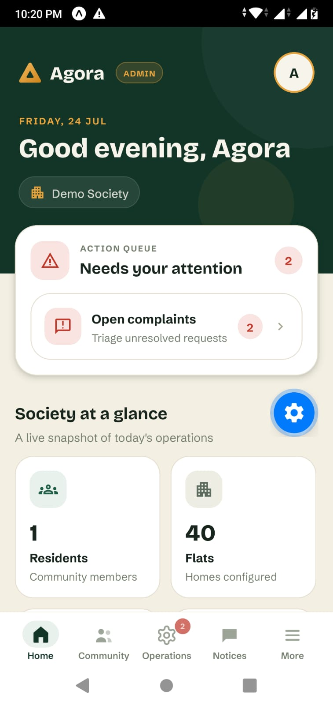<br><sub>Operations dashboard</sub></td>
    <td align="center">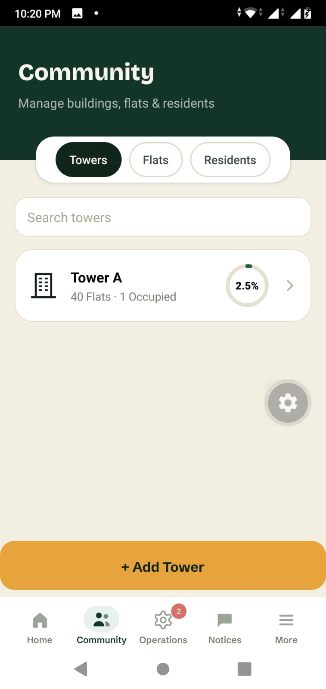<br><sub>Tower management</sub></td>
  </tr>
  <tr>
    <td align="center">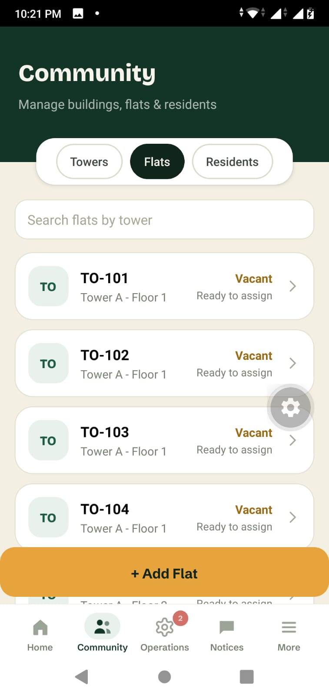<br><sub>Flat inventory</sub></td>
    <td align="center">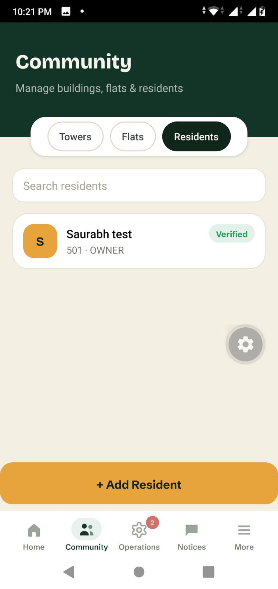<br><sub>Resident management</sub></td>
  </tr>
  <tr>
    <td align="center">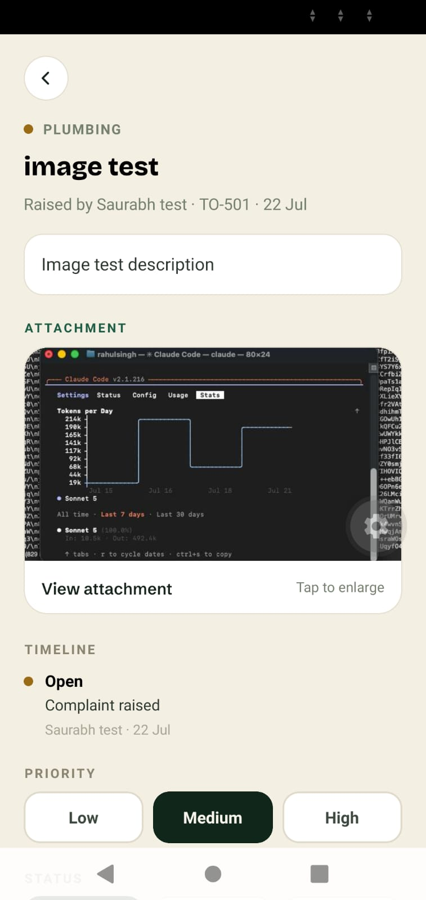<br><sub>Complaint triage</sub></td>
    <td align="center">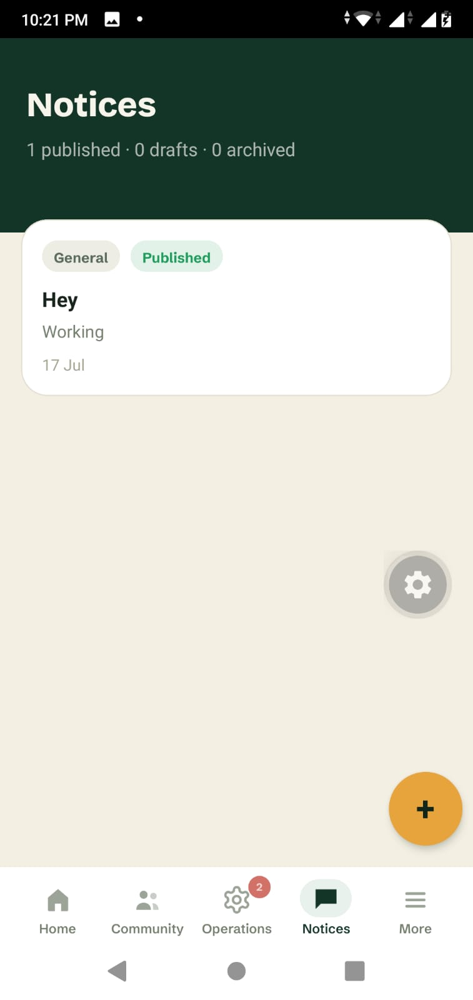<br><sub>Notice publishing</sub></td>
  </tr>
  <tr>
    <td align="center">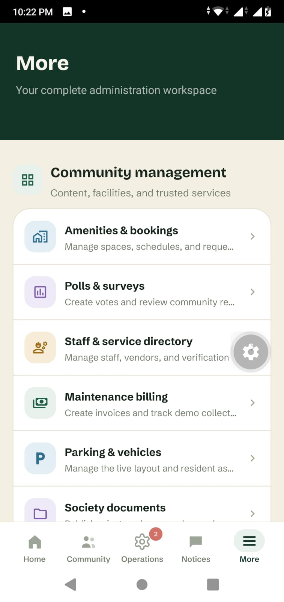<br><sub>Community tools</sub></td>
    <td align="center">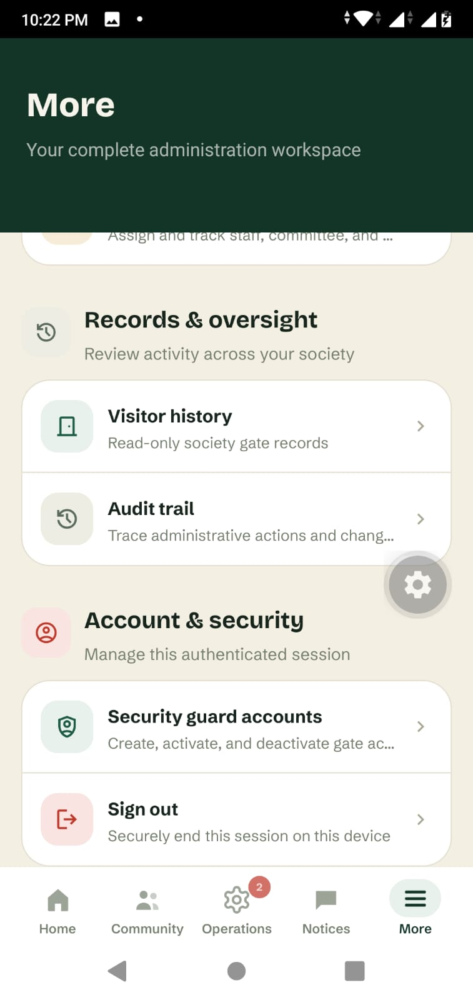<br><sub>Oversight &amp; security</sub></td>
  </tr>
</table>

## Local setup

Prerequisites:

- Node.js 20 or later
- Bun 1.3.8 or a compatible package manager
- Docker-compatible runtime for local Supabase
- Android/iOS device or emulator supported by Expo

```bash
cp .env.example .env
bun install --frozen-lockfile
./node_modules/.bin/supabase start
bun start
```

Required public client variables:

```dotenv
EXPO_PUBLIC_SUPABASE_URL=
EXPO_PUBLIC_SUPABASE_ANON_KEY=
```

Optional Sentry runtime reporting:

```dotenv
EXPO_PUBLIC_SENTRY_DSN=
```

`SENTRY_AUTH_TOKEN`, `SENTRY_ORG`, and `SENTRY_PROJECT` are private build/CI values. Never prefix them with `EXPO_PUBLIC_` or commit real values.

## Quality gates

```bash
bun run typecheck
bun run check:functions
bun run test:functions
bun run lint
npx expo-doctor
./node_modules/.bin/supabase db reset --local
./node_modules/.bin/supabase test db
bun run export:android
```

Latest local verification on August 8, 2026:

- 21 database suites and 512 pgTAP assertions passed
- TypeScript passed
- full ESLint passed
- Expo Doctor passed 20/20 checks
- Android production export passed

The export validates the Android JavaScript bundle; an installable APK still requires an authenticated EAS preview build and physical-device verification.

CI repeats the app and database gates for feature branches, fixes, pull requests, and `main`.

## Demo payments

The resident payment flow uses Razorpay Standard Checkout in **Test Mode**. Agora creates the order in an authenticated Supabase Edge Function, opens a short-lived hosted checkout, verifies the returned HMAC signature and captured payment against Razorpay server-to-server, and only then records an idempotent `RAZORPAY_TEST` payment. No real money is transferred and the receipt is not proof of payment.

Configure only Test Mode credentials and enable automatic capture in the Razorpay Dashboard:

```bash
bunx supabase secrets set RAZORPAY_KEY_ID=rzp_test_xxx RAZORPAY_KEY_SECRET=xxx
bunx supabase functions deploy razorpay-create-order
bunx supabase functions deploy razorpay-checkout --no-verify-jwt
bunx supabase functions deploy razorpay-verify-payment
```

The Key Secret is server-only. Never put it in `EXPO_PUBLIC_*`, `.env` committed to Git, app code, or screenshots. A signed webhook for `order.paid`, `payment.captured`, and `payment.failed` remains the post-demo reliability step; a client callback is never authoritative.

## Demo accounts

These credentials are for hackathon evaluation only. Before submission, verify that every
hosted Supabase Auth user has the matching active Agora profile, society assignment, and
resident flat assignment where applicable.

| Role     | Email              | Password   | Status   |
| -------- | ------------------ | ---------- | -------- |
| Resident | resident@gmail.com | Srb567890@ | Verified |
| Guard    | guard@cedar.test   | password   | Verified |
| Admin    | admin@cedar.test   | password   | Verified |

Never reuse these credentials for production accounts or publish a Supabase secret/service-role key.
