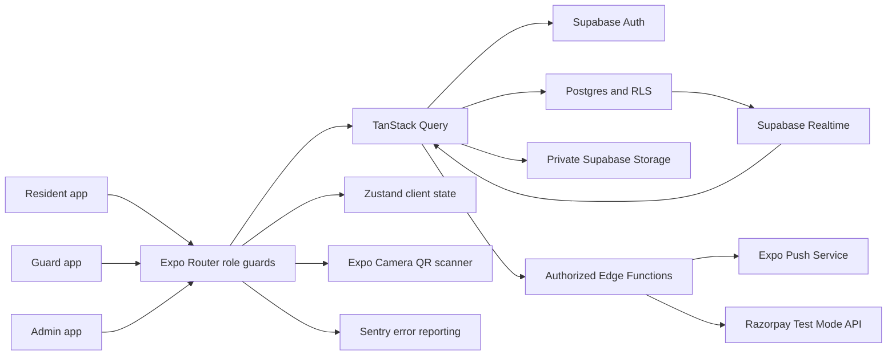
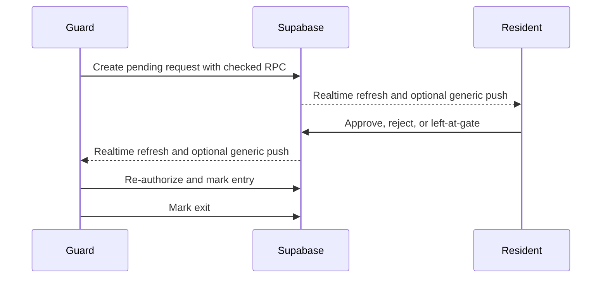
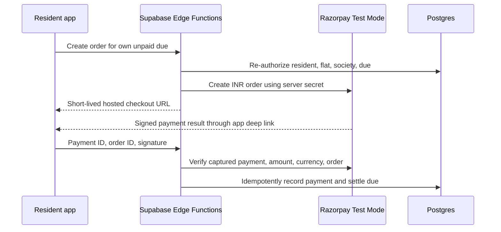

# Agora Architecture

## System context

Agora is a phone-first Expo managed application. Supabase is the only backend and source of truth. TanStack Query owns remote state and cache invalidation; Zustand is limited to authenticated session context and transient UI state.

## Role boundaries

| Role | Route group | Server authority |
| --- | --- | --- |
| Resident | `(resident)` | Own active profile, society, and flat; own or flat-owned workflows only |
| Guard | `(guard)` | Own active profile and society; gate operations only |
| Admin | `(admin)` | Own active profile and society; management operations only |

Navigation guards improve UX but are not authorization. Every client-accessible table uses RLS, and privileged mutations use checked database functions or authenticated Edge Functions.

## Tenant isolation

Every domain record carries a non-null `society_id`. Queries, mutations, Realtime filters, storage paths, notification audiences, and server operations derive or verify society scope from the authenticated profile. Composite foreign keys and checked RPCs reject cross-society relationships. The pgTAP suite includes allowed-role, denied-role, ownership, inactive-user, and cross-society cases.

## Critical workflows

### Visitor approval

Resident pre-approval creates a server-generated six-digit pass with a validity window. The QR contains only the formatted pass lookup value. Scanning never grants entry: the guard app calls the same society-scoped server lookup and then the normal entry RPC.

### Maintenance payment

The hackathon flow is real Razorpay Standard Checkout in Test Mode, not a simulated client write. The invoice changes to paid only after server-side HMAC verification and a direct captured-payment lookup. Credentials exist only as Supabase secrets. A signed webhook is still required before live production settlement so delayed/out-of-band gateway events reconcile independently of the app.

## Reliability

- SecureStore-backed, chunked Supabase session persistence; legacy plaintext-adjacent storage is cleared.
- Realtime plus refreshable screens remain available when notification permission or delivery fails.
- Notification taps are allowlisted by type and role, then the destination refetches under RLS.
- Query and mutation failures are captured by Sentry when configured.
- NetInfo drives TanStack Query online and focus managers; cached in-session data remains readable, retries pause offline, and active queries refetch on reconnect.
- Push sends are batched, retried on transient Expo failures, and tracked through a society-scoped ticket/receipt ledger; later sends opportunistically drain receipts.
- A root error boundary gives users a recoverable failure state.
- CI runs TypeScript, ESLint, Expo Doctor, Android export, clean Supabase startup, and all pgTAP tests.

## Known deployment dependencies

- Supabase migrations and Edge Functions must be deployed to the selected project.
- Push delivery requires EAS notification credentials and physical-device validation.
- Sentry requires DSN, organization, project, and CI auth-token configuration.
- Razorpay checkout requires Test Key ID/Secret plus automatic capture; production settlement additionally requires a verified webhook and Live Mode readiness.
